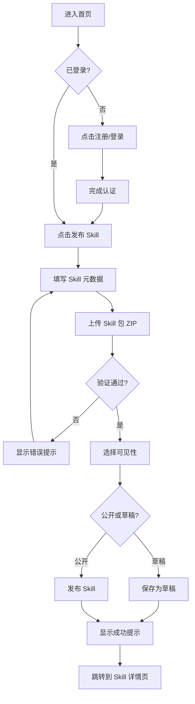
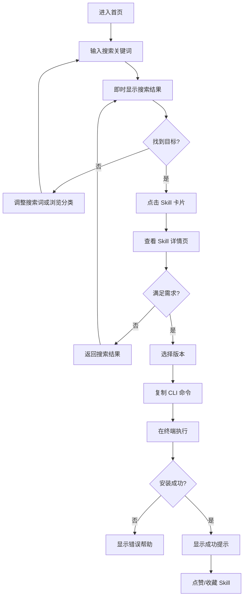
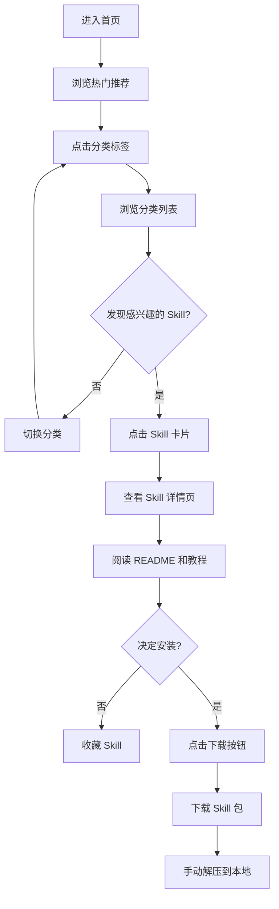

# UX Design Specification - Skills Hub

**Author:** opc-starter
**Date:** 2026-03-19

---

## Executive Summary

### Project Vision

Skills Hub 是 AI Agent Skills 的统一市场 — 让 Skill 的发现像搜索 npm 包一样简单，安装像一键点击一样顺畅，分享像发布一条推文一样自然。

**核心差异化：**
- 统一入口 — 第一个跨工具的 Skills 市场
- 社交驱动 — 点赞、收藏形成质量信号
- 版本管理 — 语义化版本 + 选择性安装
- 双端安装 — 本地 CLI + 云端平台

### Target Users

| 用户类型 | 需求 | 技术水平 |
|----------|------|----------|
| **Skill 作者** | 曝光渠道、社区反馈、版本管理 | 高（开发者） |
| **开发者用户** | 搜索发现、质量评估、一键安装 | 高（开发者） |
| **普通 AI 用户** | 低门槛发现、信任信号引导选择 | 中（会用 AI 工具但不写代码） |

### Key Design Challenges

**挑战 1：双用户群的体验平衡**
- 开发者用户期望高效、专业、可定制
- 普通 AI 用户期望简单、引导式、低门槛
- 如何在同一平台同时服务两类用户？

**挑战 2：信任信号的构建**
- 用户如何快速判断一个 Skill 是否值得安装？
- 点赞、下载量、评分如何有效呈现？
- 如何避免"冷启动"问题（新 Skill 无数据）？

**挑战 3：发布流程的简化**
- 技术用户期望快速发布，不想要繁琐表单
- 但元数据质量直接影响搜索和发现
- 如何平衡速度和质量？

### Design Opportunities

**机会 1：搜索体验的差异化**
- npm 的搜索是纯文本列表，体验较冷
- Skills Hub 可以通过卡片式布局、预览图、社交信号创造更温暖的发现体验

**机会 2：安装体验的创新**
- 一键复制 CLI 命令 + 版本选择器
- 未来云端安装的"一键同步"体验

**机会 3：作者激励循环**
- 数据看板 + 社交反馈 = 作者成就感
- 形成发布 → 反馈 → 迭代的正向循环

## Core User Experience

### Defining Experience

Skills Hub 有两个核心用户行为：

**消费者侧：搜索 → 发现 → 安装**
- 用户最频繁的行为是**搜索 Skill**
- 这是他们进入平台后的第一个动作
- 搜索体验直接决定用户是否留下来

**作者侧：发布 → 获得反馈 → 迭代**
- 作者的核心行为是**发布 Skill**
- 发布后获得反馈是关键的正向循环

### Platform Strategy

| 平台 | 优先级 | 说明 |
|------|--------|------|
| **Web 应用** | P0 | 主要交互界面，搜索、浏览、详情、发布 |
| **CLI 工具** | P1 | 开发者安装 Skill 的主要方式 |
| **移动端** | 暂不支持 | MVP 不考虑 |

**交互方式：**
- Web：鼠标 + 键盘，桌面优先（1280px+）
- CLI：命令行交互

**离线支持：**
- CLI 支持离线查看已安装 Skill 列表
- Web 端无离线需求

### Effortless Interactions

| 交互 | 期望体验 |
|------|----------|
| **搜索 Skill** | 输入关键词 → 立即看到结果，无需按回车 |
| **安装 Skill** | 复制命令 → 粘贴执行 → 完成，无需额外配置 |
| **发布 Skill** | 上传 ZIP → 自动解析元数据 → 一键发布 |
| **点赞/收藏** | 单击即完成，无需确认 |

**竞品痛点：**
- npm：搜索结果冷冰冰，无社交信号
- GitHub：找 Skill 需要翻多个仓库，无统一入口
- 手动安装：需要 clone、复制文件夹，无版本管理

### Critical Success Moments

| 时刻 | 用户感受 | 设计目标 |
|------|----------|----------|
| **首次搜索成功** | "哇，一下子就找到了" | 搜索结果精准，排序合理 |
| **首次安装成功** | "这么简单？装好了？" | CLI 命令一键复制，安装 < 10 秒 |
| **首次发布成功** | "发布完了？有人看到了吗？" | 发布流程 < 5 分钟，立即看到数据 |
| **获得第一个点赞** | "有人认可我的作品！" | 通知及时，反馈可见 |

### Experience Principles

| 原则 | 说明 |
|------|------|
| **搜索优先** | 搜索是用户的第一动作，必须做到极致 |
| **一键完成** | 所有关键操作（安装、点赞、收藏）都应一键完成 |
| **即时反馈** | 用户操作后立即看到结果，无等待焦虑 |
| **信任可见** | 下载量、点赞、评分等信任信号清晰可见 |
| **作者激励** | 发布后数据反馈形成正向循环 |

## Desired Emotional Response

### Primary Emotional Goals

| 情感 | 说明 |
|------|------|
| **成就感** | 作者发布 Skill 后获得认可，用户找到需要的 Skill 并成功安装 |
| **信任感** | 通过社交信号（下载量、点赞）建立对 Skill 质量的信任 |
| **高效感** | 搜索、发现、安装都在几分钟内完成，无等待焦虑 |
| **归属感** | 成为 AI Skills 社区的一部分，与同行交流 |

### Emotional Journey Mapping

| 阶段 | 用户行为 | 期望情感 | 设计影响 |
|------|----------|----------|----------|
| **首次访问** | 打开首页 | 好奇 + 信任 | 热门 Skill 展示、清晰的分类导航 |
| **搜索** | 输入关键词 | 期待 + 高效 | 即时搜索结果、精准排序 |
| **发现** | 浏览结果 | 兴趣 + 信任 | 卡片式布局、社交信号可见 |
| **详情** | 查看 Skill 页 | 信任 + 决心 | README 渲染、版本列表、安装命令 |
| **安装** | 执行 CLI 命令 | 期待 + 高效 | 安装进度、成功提示 |
| **发布** | 上传 Skill | 期待 + 成就 | 简化流程、即时反馈 |
| **获得反馈** | 收到点赞/下载 | 成就 + 归属 | 通知系统、数据看板 |

### Micro-Emotions

| 微情感 | 重要性 | 设计策略 |
|--------|--------|----------|
| **信心 vs 困惑** | 高 | 清晰的导航、明确的操作按钮、状态反馈 |
| **信任 vs 怀疑** | 高 | 社交信号可见、作者信息透明、版本管理 |
| **兴奋 vs 焦虑** | 中 | 快速响应、进度可见、成功提示 |
| **成就 vs 挫败** | 高 | 简化流程、错误提示友好、帮助文档 |
| **惊喜 vs 满意** | 中 | 意外的发现推荐、社交反馈通知 |
| **归属 vs 孤立** | 中 | 社区元素、作者主页、互动功能 |

### Design Implications

| 情感目标 | UX 设计策略 |
|----------|-------------|
| **成就感** | 发布后立即显示数据看板；点赞/下载通知及时推送 |
| **信任感** | 下载量、点赞数、评分在卡片和详情页显著展示 |
| **高效感** | 搜索即时响应；CLI 命令一键复制；安装进度可见 |
| **归属感** | 作者主页展示；社区分类；未来支持评论互动 |

**需要避免的负面情感：**
- **困惑**：导航不清、操作复杂
- **怀疑**：无信任信号、作者信息不透明
- **挫败**：安装失败、发布流程繁琐
- **焦虑**：等待时间长、无进度反馈

### Emotional Design Principles

| 原则 | 说明 |
|------|------|
| **即时满足** | 用户操作后立即看到结果，无等待焦虑 |
| **信任可见** | 社交信号、作者信息、版本历史清晰展示 |
| **成就反馈** | 发布、点赞、下载等行为都有即时反馈 |
| **社区归属** | 通过作者主页、分类导航建立社区感 |

## UX Pattern Analysis & Inspiration

### Inspiring Products Analysis

基于 Skills Hub 的定位（Skills 市场 + 社交发现），分析以下产品：

**npm (npmjs.com)**
- 最接近的类比：包发现和安装
- 用户熟悉的心智模型

| 维度 | 优点 | 缺点 |
|------|------|------|
| **搜索** | 快速、精准 | 结果冷冰冰，无社交信号 |
| **详情页** | README 渲染、版本列表 | 信息密集，新手不友好 |
| **安装** | CLI 命令清晰 | 无 Web 端下载选项 |

**VS Code Marketplace**
- 扩展市场，开发者用户群
- 评分、下载量、分类浏览

| 维度 | 优点 | 缺点 |
|------|------|------|
| **信任信号** | 评分、下载量、评论 | 评论质量参差不齐 |
| **发现** | 分类清晰、推荐位 | 首页信息过载 |

**Product Hunt**
- 社交发现 + 点赞机制
- 每日推荐、热门排序

| 维度 | 优点 | 缺点 |
|------|------|------|
| **社交发现** | 点赞、评论、收藏 | 评论噪音多 |
| **卡片设计** | 信息密度适中 | 图片加载影响速度 |

**GitHub**
- 仓库发现、Star 机制
- README 渲染、版本管理

| 维度 | 优点 | 缺点 |
|------|------|------|
| **社交信号** | Star、Fork、Watch | 无统一质量评分 |
| **README** | Markdown 渲染优秀 | 格式不统一 |

### Transferable UX Patterns

**导航模式：**

| 模式 | 来源 | 适用于 Skills Hub |
|------|------|-------------------|
| **顶部搜索栏** | npm、GitHub | 首页核心，搜索优先 |
| **左侧分类导航** | VS Code Marketplace | 按平台、分类筛选 |
| **标签云/热门标签** | GitHub | 快速发现热门领域 |

**交互模式：**

| 模式 | 来源 | 适用于 Skills Hub |
|------|------|-------------------|
| **卡片式列表** | Product Hunt | Skill 卡片展示名称、描述、社交信号 |
| **一键复制命令** | npm | CLI 安装命令一键复制 |
| **点赞/收藏** | Product Hunt、GitHub | 单击完成，即时反馈 |
| **版本选择器** | GitHub Releases | 下拉选择版本安装 |

**视觉模式：**

| 模式 | 来源 | 适用于 Skills Hub |
|------|------|-------------------|
| **信任信号徽章** | VS Code Marketplace | 下载量、点赞数、评分徽章 |
| **作者信息展示** | GitHub | 头像、用户名、关注按钮 |
| **README 渲染** | GitHub、npm | Markdown 渲染 + 目录导航 |

### Anti-Patterns to Avoid

| 反模式 | 问题 | 来源 |
|--------|------|------|
| **信息过载** | 首页塞太多信息，用户不知所措 | VS Code Marketplace |
| **冷启动困境** | 新内容无曝光机会 | Product Hunt（每日重置） |
| **搜索结果冷淡** | 纯文本列表，无社交信号 | npm |
| **安装流程复杂** | 多步骤、需手动配置 | 手动 clone 仓库 |
| **评分噪音** | 评论质量低，无参考价值 | 部分市场 |

### Design Inspiration Strategy

**采用：**

| 模式 | 原因 |
|------|------|
| **卡片式布局** | 信息密度适中，社交信号可见 |
| **顶部搜索栏 + 即时搜索** | 搜索是核心行为，需做到极致 |
| **一键复制 CLI 命令** | 开发者熟悉的心智模型 |
| **点赞/收藏单交互** | 即时反馈，形成正向循环 |

**适配：**

| 模式 | 适配方式 |
|------|----------|
| **分类导航** | 按平台、标签筛选，而非左侧边栏 |
| **版本选择器** | 下拉选择 + CLI 命令自动更新 |
| **信任信号** | 下载量 + 点赞数，暂无评分（MVP） |

**避免：**

| 反模式 | 原因 |
|--------|------|
| **首页信息过载** | 保持简洁，聚焦搜索和推荐 |
| **冷启动困境** | 新 Skill 有"最新发布"曝光位 |
| **搜索结果冷淡** | 卡片 + 社交信号，温暖体验 |

## Design System Foundation

### Design System Choice

**选择：Tailwind CSS 4.1 + shadcn/ui**

基于 OPC-Starter 现有技术栈，继续使用 Tailwind CSS 4.1 作为样式基础，引入 shadcn/ui 作为组件库。

### Rationale for Selection

| 决策因素 | 分析 |
|----------|------|
| **技术一致性** | OPC-Starter 已使用 Tailwind CSS 4.1 |
| **开发速度** | shadcn/ui 提供高质量组件，加速开发 |
| **可定制性** | 组件源码可控，适配 Skills Hub 风格 |
| **无障碍** | shadcn/ui 内置无障碍支持 |
| **包体积** | 只引入需要的组件，无运行时开销 |

### Implementation Approach

**组件采用策略：**

| 组件 | 来源 | 说明 |
|------|------|------|
| Button | shadcn/ui | 基础按钮 |
| Input | shadcn/ui | 搜索框、表单输入 |
| Card | shadcn/ui | Skill 卡片 |
| Dialog | shadcn/ui | 确认弹窗 |
| Dropdown | shadcn/ui | 版本选择器 |
| Badge | shadcn/ui | 标签、平台徽章 |
| Toast | shadcn/ui | 操作反馈 |
| Skeleton | shadcn/ui | 加载状态 |

### Customization Strategy

**自定义组件：**

| 组件 | 说明 |
|------|------|
| SkillCard | Skill 卡片（含社交信号） |
| SearchBar | 即时搜索栏 |
| InstallCommand | CLI 命令复制组件 |
| VersionSelector | 版本选择器 |
| AuthorCard | 作者信息卡片 |

**设计令牌扩展：**
- 扩展现有 Tailwind 配置，添加 Skills Hub 专属颜色和间距
- 复用 OPC-Starter 的设计令牌规范（docs/DESIGN_TOKENS.md）

## Defining Core Experience

### Defining Experience

**Skills Hub 的定义性体验：**

> **"搜索 → 发现 → 一键安装"**

用户会如何向朋友描述 Skills Hub：

> "你只要搜一下，找到想要的 Skill，复制一行命令，就装好了。"

### User Mental Model

**用户当前如何解决这个问题：**

| 当前方案 | 痛点 |
|----------|------|
| GitHub 搜索 | 结果分散，无质量信号 |
| Twitter 推荐 | 随机性强，难以发现 |
| 同事分享 | 范围有限 |
| 手动 clone | 无版本管理，配置繁琐 |

**用户期望：**
- 一个地方找到所有 Skill
- 知道哪个 Skill 值得信任
- 安装过程简单快速

**用户可能困惑的地方：**
- Skill 是什么？（新手用户）
- 如何选择版本？
- 安装到哪里？

### Success Criteria

| 指标 | 目标 |
|------|------|
| **搜索到找到** | < 2 分钟 |
| **安装完成** | < 10 秒 |
| **首次成功率** | > 95% |

**成功指标：**
- 用户搜索后点击结果（找到目标）
- 用户复制 CLI 命令（准备安装）
- 用户成功安装（完成目标）

### Novel UX Patterns

**Skills Hub 的核心交互使用成熟模式：**

| 维度 | 分析 |
|------|------|
| **搜索** | 成熟模式（npm、GitHub） |
| **卡片展示** | 成熟模式 |
| **CLI 安装** | 成熟模式 |
| **社交信号** | 成熟模式 |

**创新点：**
1. **即时搜索**：输入即搜索，无需按回车
2. **信任信号整合**：下载量 + 点赞数 + 版本信息
3. **一键命令复制**：CLI 命令一键复制，版本自动更新

### Experience Mechanics

**核心体验：搜索 → 发现 → 安装**

**1. 发起：**
- 用户进入首页，看到顶部搜索栏
- 搜索栏有占位提示："搜索 AI Skills..."
- 热门标签引导探索

**2. 交互：**
- 用户输入关键词
- 即时显示搜索结果（卡片列表）
- 用户浏览卡片，点击进入详情页

**3. 反馈：**
- 搜索结果即时更新
- 卡片显示下载量、点赞数
- 详情页显示 README、版本列表

**4. 完成：**
- 用户选择版本
- 一键复制 CLI 命令
- 在终端执行，安装完成

## Visual Design Foundation

### Color System

**复用 OPC-Starter 现有颜色系统：**

| Token | 用途 | 亮色模式 | 暗色模式 |
|-------|------|----------|----------|
| `primary` | 主色（深森林绿） | `hsl(145 40% 28%)` | `hsl(145 50% 45%)` |
| `accent` | 强调色（琥珀橙） | `hsl(38 92% 50%)` | `hsl(38 85% 55%)` |
| `background` | 页面背景 | `hsl(50 20% 98%)` | `hsl(220 20% 10%)` |
| `card` | 卡片背景 | `hsl(0 0% 100%)` | `hsl(220 20% 13%)` |

**Skills Hub 扩展颜色：**

| Token | 用途 | 值 |
|-------|------|-----|
| `skill-downloads` | 下载量徽章 | `bg-primary/10 text-primary` |
| `skill-likes` | 点赞徽章 | `bg-accent/10 text-accent` |

### Typography System

**复用 OPC-Starter 字体系统：**

| 用途 | 字体 | 说明 |
|------|------|------|
| **标题** | Nunito | 温暖、友好，适合 Skill 名称 |
| **正文** | Plus Jakarta Sans | 清晰、易读，适合描述和 README |

**字重规范：**

| 用途 | 字重 |
|------|------|
| Skill 名称 | 700 (Bold) |
| 描述文字 | 400 (Regular) |
| 标签/徽章 | 500 (Medium) |

### Spacing & Layout Foundation

| 原则 | 说明 |
|------|------|
| **卡片间距** | 16px (gap-4)，保持透气感 |
| **内容密度** | 适中，不过于密集 |
| **网格系统** | 3 列（桌面）/ 2 列（平板）/ 1 列（移动） |

**圆角规范：**

| 元素 | 圆角 |
|------|------|
| Skill 卡片 | 12px (--radius-lg) |
| 按钮 | 10px (--radius-md) |
| 徽章 | 8px (--radius-sm) |

### Accessibility Considerations

| 维度 | 要求 |
|------|------|
| **对比度** | 文字与背景对比度 ≥ 4.5:1（WCAG AA） |
| **焦点状态** | 使用 `ring` 颜色，清晰可见 |
| **字体大小** | 正文 ≥ 14px，标题 ≥ 20px |
| **交互区域** | 点击区域 ≥ 44px × 44px |

## Design Direction Decision

### Design Directions Explored

基于 OPC-Starter 现有设计令牌，定义 Skills Hub 的设计方向：

| 维度 | 方向 |
|------|------|
| **整体风格** | 温暖亲和 + 专业可信 |
| **布局** | 卡片式网格，清晰的信息层级 |
| **交互** | 即时响应，一键操作 |
| **视觉重量** | 适中，不过于密集也不过于稀疏 |

### Chosen Direction

**首页布局：**
- 顶部：Logo + 搜索栏 + 登录/注册
- 搜索栏下方：热门标签
- 主体：热门 Skills（3 列卡片） + 最新发布（3 列卡片）
- 卡片内容：名称、描述、下载量、点赞数

**Skill 详情页布局：**
- 顶部：返回链接 + 搜索栏
- 标题区：名称 + 作者 + 点赞/收藏按钮
- 信息区：描述 + 标签 + 平台
- 安装区：CLI 命令 + 版本选择器 + 复制按钮
- 统计区：下载量 + 点赞数 + 收藏数
- 内容区：README 渲染
- 底部：版本历史

### Design Rationale

| 决策 | 理由 |
|------|------|
| **卡片式布局** | 符合 Product Hunt 的成功模式，信息密度适中 |
| **即时搜索** | 搜索是核心体验，必须突出 |
| **社交信号在卡片内可见** | 减少点击，快速评估 |
| **CLI 命令一键复制** | 开发者熟悉的心智模型 |
| **简洁导航** | 聚焦核心功能，减少干扰 |

### Implementation Approach

**页面结构：**

| 页面 | 路由 | 说明 |
|------|------|------|
| 首页 | `/` | 搜索 + 热门/最新 Skill 列表 |
| 搜索结果 | `/search?q=keyword` | 搜索结果列表 |
| Skill 详情 | `/skill/:slug` | Skill 详情页 |
| 用户主页 | `/user/:username` | 用户发布的 Skill 列表 |
| 发布页 | `/publish` | 发布新 Skill |

**组件清单：**

| 组件 | 说明 |
|------|------|
| SearchBar | 即时搜索栏 |
| SkillCard | Skill 卡片 |
| InstallCommand | CLI 命令复制组件 |
| VersionSelector | 版本选择器 |
| AuthorCard | 作者信息卡片 |
| StatsBadge | 统计徽章（下载量/点赞数） |

## User Journey Flows

### Journey 1: 作者发布流程



**流程优化：**
- 上传时自动解析 ZIP 中的 `SKILL.md`，预填充元数据
- 实时验证，即时反馈
- 发布后立即跳转到详情页，看到数据

### Journey 2: 开发者发现流程



**流程优化：**
- 即时搜索，输入即显示结果
- 卡片内显示社交信号，减少点击
- CLI 命令一键复制，版本自动更新

### Journey 3: 普通用户探索流程



**流程优化：**
- 首页突出热门推荐，降低发现门槛
- README 渲染清晰，新手友好
- 提供图文教程（未来）

### Journey Patterns

**导航模式：**
- 面包屑导航（详情页返回搜索）
- 标签导航（分类切换）
- 用户菜单（登录后）

**决策模式：**
- 卡片预览 → 详情页深入
- 版本选择器 → CLI 命令更新
- 确认弹窗（删除、发布）

**反馈模式：**
- Toast 提示（操作成功/失败）
- 加载状态（搜索、上传）
- 空状态（无搜索结果）

### Flow Optimization Principles

| 原则 | 说明 |
|------|------|
| **最小步骤** | 搜索 → 发现 → 安装，3 步完成 |
| **即时反馈** | 搜索、点赞、收藏即时响应 |
| **错误恢复** | 提供清晰的错误提示和解决方案 |
| **进度可见** | 上传、安装显示进度 |

## Component Strategy

### Design System Components

**shadcn/ui 提供的组件：**

| 组件 | 用途 | Skills Hub 使用场景 |
|------|------|---------------------|
| Button | 按钮 | 发布、点赞、收藏、登录 |
| Input | 输入框 | 搜索栏、表单 |
| Card | 卡片 | Skill 卡片基础 |
| Dialog | 弹窗 | 确认删除、登录提示 |
| Dropdown | 下拉菜单 | 版本选择器、用户菜单 |
| Badge | 徽章 | 标签、平台标识 |
| Toast | 提示 | 操作反馈 |
| Skeleton | 骨架屏 | 加载状态 |
| Avatar | 头像 | 作者头像 |
| Tabs | 标签页 | README/版本切换 |

### Custom Components

**SkillCard：**

| 属性 | 说明 |
|------|------|
| **Purpose** | 展示 Skill 摘要信息，引导用户点击查看详情 |
| **Content** | 名称、描述、标签、下载量、点赞数、作者头像 |
| **Actions** | 点击跳转详情页 |
| **States** | default, hover（阴影 + 边框高亮） |
| **Accessibility** | 整卡可点击，键盘可聚焦 |

**SearchBar：**

| 属性 | 说明 |
|------|------|
| **Purpose** | 即时搜索，核心入口 |
| **Content** | 搜索图标、输入框、热门标签 |
| **Actions** | 输入即搜索，点击标签触发搜索 |
| **States** | default, focus, loading |
| **Accessibility** | 自动聚焦，ARIA label |

**InstallCommand：**

| 属性 | 说明 |
|------|------|
| **Purpose** | 一键复制 CLI 安装命令 |
| **Content** | 命令文本、复制按钮、版本选择器 |
| **Actions** | 点击复制，选择版本更新命令 |
| **States** | default, copied（显示"已复制"） |
| **Accessibility** | 复制成功 Toast 提示 |

**VersionSelector / StatsBadge / AuthorCard / EmptyState：**
- VersionSelector：下拉选择 + CLI 命令自动更新
- StatsBadge：图标 + 数字（下载量/点赞数）
- AuthorCard：Avatar + 用户名 + Skill 数量
- EmptyState：图标 + 提示文字 + 操作建议

### Component Implementation Strategy

**基础组件（shadcn/ui）：**
- 直接引入使用
- 使用 Tailwind CSS 变量定制样式
- 遵循 OPC-Starter 设计令牌

**自定义组件：**
- 基于 shadcn/ui 组件组合
- 使用 Tailwind CSS 样式
- 遵循设计令牌和体验原则

### Implementation Roadmap

**Phase 1 - 核心组件（P0）：**

| 组件 | 用于 |
|------|------|
| SkillCard | 首页、搜索结果 |
| SearchBar | 首页、搜索页 |
| InstallCommand | Skill 详情页 |

**Phase 2 - 支持组件（P1）：**

| 组件 | 用于 |
|------|------|
| VersionSelector | Skill 详情页 |
| StatsBadge | SkillCard、详情页 |
| AuthorCard | 详情页、用户主页 |

**Phase 3 - 增强组件（P2）：**

| 组件 | 用于 |
|------|------|
| EmptyState | 搜索无结果 |
| SkillPublishForm | 发布页 |

## UX Consistency Patterns

### Button Hierarchy

| 类型 | 样式 | 使用场景 |
|------|------|----------|
| **Primary** | `bg-primary text-white` | 发布 Skill、提交表单、主要 CTA |
| **Secondary** | `bg-secondary text-secondary-foreground` | 取消、返回、次要操作 |
| **Outline** | `border border-primary text-primary` | 点赞、收藏（未激活状态） |
| **Ghost** | `text-primary hover:bg-primary/10` | 导航链接、图标按钮 |
| **Destructive** | `bg-destructive text-white` | 删除 Skill |

**按钮尺寸：**

| 尺寸 | 高度 | 字号 | 使用场景 |
|------|------|------|----------|
| sm | 32px | 14px | 徽章内操作、紧凑布局 |
| default | 40px | 14px | 主要操作按钮 |
| lg | 48px | 16px | 首页 CTA、发布按钮 |

### Feedback Patterns

**成功反馈：**
- Toast 提示：`bg-green-500 text-white`，3 秒自动消失
- 示例：发布成功、点赞成功、收藏成功

**错误反馈：**
- Toast 提示：`bg-destructive text-white`，5 秒自动消失
- 表单内联错误：红色边框 + 错误文字
- 示例：上传失败、验证错误

**警告反馈：**
- Toast 提示：`bg-amber-500 text-white`
- 示例：版本不兼容、即将删除

**信息反馈：**
- Toast 提示：`bg-primary text-white`
- 示例：复制成功、已保存草稿

### Form Patterns

**输入框状态：**

| 状态 | 样式 |
|------|------|
| default | `border-input` |
| focus | `ring-2 ring-primary/20 border-primary` |
| error | `border-destructive ring-2 ring-destructive/20` |
| disabled | `bg-muted text-muted-foreground cursor-not-allowed` |

**表单验证：**
- 实时验证：输入时即时反馈
- 提交验证：提交前统一验证
- 错误提示：字段下方显示具体错误信息

**必填标识：**
- 使用 `*` 星号标记必填字段
- 灰色文字提示可选字段

### Navigation Patterns

**顶部导航：**
- Logo + 搜索栏 + 用户菜单（登录后）/ 登录注册按钮（未登录）
- 固定顶部，滚动时保持可见
- 背景：`bg-background/80 backdrop-blur`

**面包屑导航：**
- 首页 > 搜索结果 > Skill 详情
- 使用 ` ChevronRight` 图标分隔
- 当前页面高亮，其他可点击

**标签导航：**
- 分类标签使用 Badge 组件
- 激活状态：`bg-primary text-white`
- 未激活状态：`bg-muted text-muted-foreground`

### Loading & Empty States

**加载状态：**
- 搜索加载：骨架屏（Skeleton）
- 上传加载：进度条 + 百分比
- 按钮加载：Spinner + 禁用状态

**空状态：**
- 无搜索结果：搜索图标 + "未找到相关 Skill" + 建议关键词
- 无发布 Skill：发布图标 + "还没有发布 Skill" + "发布第一个" 按钮
- 无收藏：收藏图标 + "还没有收藏" + "去发现"

### Search & Filter Patterns

**搜索交互：**
- 即时搜索：输入 300ms 后触发搜索
- 搜索建议：显示热门搜索词
- 历史记录：保存最近 5 条搜索记录

**筛选器：**
- 平台筛选：下拉选择（Cursor / Claude / Cline / Windsurf）
- 排序选择：下拉选择（最新 / 最热 / 下载量）
- 标签筛选：点击标签添加筛选条件

## Responsive & Accessibility

### Responsive Strategy

**MVP 响应式优先级：**

| 设备 | 优先级 | 说明 |
|------|--------|------|
| **桌面 (1280px+)** | P0 | 主要使用场景，开发者用户 |
| **平板 (768px-1279px)** | P1 | 次要场景，保持可用性 |
| **移动 (< 768px)** | P2 | MVP 不优先，保持基本可用 |

### Breakpoint System

| 断点 | 宽度 | 布局调整 |
|------|------|----------|
| `sm` | 640px | 单列卡片，搜索栏全宽 |
| `md` | 768px | 2 列卡片，侧边栏折叠 |
| `lg` | 1024px | 2 列卡片，侧边栏展开 |
| `xl` | 1280px | 3 列卡片，完整布局 |
| `2xl` | 1536px | 3 列卡片，最大内容宽度限制 |

### Responsive Layout Patterns

**首页布局：**

| 断点 | 卡片列数 | 搜索栏 | 导航 |
|------|----------|--------|------|
| xl+ | 3 列 | 居中，最大宽度 600px | 完整导航 |
| lg | 2 列 | 居中，最大宽度 500px | 完整导航 |
| md | 2 列 | 全宽 | 汉堡菜单 |
| sm | 1 列 | 全宽 | 汉堡菜单 |

**Skill 详情页布局：**

| 断点 | 布局 |
|------|------|
| xl+ | 左侧 2/3 README，右侧 1/3 安装区 + 统计 |
| lg-md | 上方安装区 + 统计，下方 README |
| sm | 垂直堆叠，安装区固定底部 |

### Touch Interactions

| 交互 | 触屏适配 |
|------|----------|
| **Skill 卡片** | 整卡可点击，点击区域 ≥ 44px |
| **点赞/收藏** | 大图标按钮，点击区域 44px × 44px |
| **版本选择** | 原生下拉选择器 |
| **复制命令** | 大按钮，点击后 Toast 提示 |

### Accessibility Standards

**WCAG 2.1 AA 合规：**

| 维度 | 要求 | 实现方式 |
|------|------|----------|
| **对比度** | 文字与背景 ≥ 4.5:1 | 使用设计令牌定义的颜色 |
| **焦点可见** | 所有交互元素可聚焦 | `ring-2 ring-primary` 焦点样式 |
| **键盘导航** | Tab 顺序合理，可操作 | 语义化 HTML，tabindex 管理 |
| **屏幕阅读器** | 所有内容可读 | ARIA labels，语义化标签 |
| **表单标签** | 所有输入有标签 | `<label>` 关联，aria-label |

### Semantic HTML Structure

**首页结构：**
```html
<header role="banner">
  <nav role="navigation" aria-label="主导航">
    <!-- Logo, 搜索, 用户菜单 -->
  </nav>
</header>
<main role="main">
  <section aria-label="热门 Skills">
    <h2>热门 Skills</h2>
    <ul role="list">
      <!-- Skill 卡片 -->
    </ul>
  </section>
  <section aria-label="最新发布">
    <h2>最新发布</h2>
    <ul role="list">
      <!-- Skill 卡片 -->
    </ul>
  </section>
</main>
<footer role="contentinfo">
  <!-- 版权信息 -->
</footer>
```

### ARIA Labels

| 元素 | ARIA Label |
|------|------------|
| 搜索输入框 | `aria-label="搜索 Skills"` |
| 点赞按钮 | `aria-label="点赞此 Skill"` |
| 收藏按钮 | `aria-label="收藏此 Skill"` |
| 复制按钮 | `aria-label="复制安装命令"` |
| 版本选择器 | `aria-label="选择版本"` |
| Skill 卡片 | `aria-label="Skill: {name}"` |

### Focus Management

| 场景 | 焦点处理 |
|------|----------|
| **打开弹窗** | 焦点移到弹窗第一个可聚焦元素 |
| **关闭弹窗** | 焦点返回触发元素 |
| **搜索结果更新** | 焦点保持在搜索框 |
| **页面跳转** | 焦点移到主内容区 |
| **Toast 出现** | 不改变焦点，aria-live 通知 |

### Screen Reader Announcements

| 场景 | 通知内容 |
|------|----------|
| **搜索完成** | "找到 X 个 Skills" |
| **点赞成功** | "已点赞此 Skill" |
| **收藏成功** | "已收藏此 Skill" |
| **复制成功** | "安装命令已复制到剪贴板" |
| **发布成功** | "Skill 发布成功" |
| **加载中** | "正在加载..." |

### Color Contrast Verification

| 元素 | 前景色 | 背景色 | 对比度 | 状态 |
|------|--------|--------|--------|------|
| 正文文字 | `hsl(220 20% 20%)` | `hsl(50 20% 98%)` | 12.5:1 | ✅ |
| 次要文字 | `hsl(220 20% 40%)` | `hsl(50 20% 98%)` | 5.2:1 | ✅ |
| 主按钮 | `white` | `hsl(145 40% 28%)` | 5.8:1 | ✅ |
| 强调按钮 | `white` | `hsl(38 92% 50%)` | 3.2:1 | ⚠️ 大文本 |
| 链接文字 | `hsl(145 40% 28%)` | `hsl(50 20% 98%)` | 5.8:1 | ✅ |

**暗色模式对比度：**

| 元素 | 前景色 | 背景色 | 对比度 | 状态 |
|------|--------|--------|--------|------|
| 正文文字 | `hsl(220 20% 90%)` | `hsl(220 20% 10%)` | 11.2:1 | ✅ |
| 次要文字 | `hsl(220 20% 70%)` | `hsl(220 20% 10%)` | 4.8:1 | ✅ |
| 主按钮 | `white` | `hsl(145 50% 45%)` | 4.5:1 | ✅ |

---

## Summary & Next Steps

### UX Design Summary

**Skills Hub UX 设计核心决策：**

| 维度 | 决策 |
|------|------|
| **定义性体验** | 搜索 → 发现 → 一键安装 |
| **设计风格** | 温暖亲和 + 专业可信 |
| **布局模式** | 卡片式网格，3 列（桌面） |
| **交互原则** | 即时响应，一键操作 |
| **信任信号** | 下载量 + 点赞数，卡片内可见 |
| **设计系统** | Tailwind CSS 4.1 + shadcn/ui |

### Key Design Decisions

**1. 搜索优先策略**
- 首页顶部突出搜索栏
- 即时搜索，输入即显示结果
- 热门标签引导探索

**2. 信任信号可见**
- 卡片内展示下载量、点赞数
- 详情页展示版本历史、作者信息
- README 渲染展示 Skill 质量

**3. 一键安装体验**
- CLI 命令一键复制
- 版本选择器自动更新命令
- 安装成功 Toast 提示

**4. 双用户群平衡**
- 开发者：CLI 安装、版本选择、高级搜索
- 普通用户：Web 下载、热门推荐、引导式发现

### Implementation Priority

**Phase 1 - MVP 核心（P0）：**

| 页面 | 组件 | 优先级 |
|------|------|--------|
| 首页 | SearchBar, SkillCard | P0 |
| 搜索结果页 | SkillCard, EmptyState | P0 |
| Skill 详情页 | InstallCommand, VersionSelector | P0 |
| 认证 | LoginDialog, RegisterForm | P0 |

**Phase 2 - 作者功能（P1）：**

| 页面 | 组件 | 优先级 |
|------|------|--------|
| 发布页 | SkillPublishForm | P1 |
| 用户主页 | AuthorCard, SkillCard | P1 |
| 数据看板 | StatsChart | P2 |

**Phase 3 - 增强功能（P2）：**

| 功能 | 组件 | 优先级 |
|------|------|--------|
| 高级搜索 | FilterPanel | P2 |
| 通知系统 | NotificationCenter | P2 |
| 评论系统 | CommentSection | P3 |

### Design Tokens Summary

**颜色（复用 OPC-Starter）：**
- Primary: `hsl(145 40% 28%)` (深森林绿)
- Accent: `hsl(38 92% 50%)` (琥珀橙)
- Background: `hsl(50 20% 98%)` (暖白)

**字体：**
- 标题：Nunito
- 正文：Plus Jakarta Sans

**圆角：**
- 卡片：12px
- 按钮：10px
- 徽章：8px

### Accessibility Checklist

- [ ] 所有交互元素可键盘聚焦
- [ ] 焦点样式清晰可见（ring-2）
- [ ] 文字对比度 ≥ 4.5:1
- [ ] ARIA labels 完整
- [ ] 屏幕阅读器测试通过
- [ ] 触屏点击区域 ≥ 44px

### Next Steps

1. **Architecture Design (CA)** - 创建技术架构设计
2. **Epic & Story Creation (CE)** - 将 PRD 和 UX 设计拆分为可执行的 Epics 和 Stories
3. **Implementation** - 开始开发 Phase 1 核心功能

---

**Document Status:** ✅ Complete

**Created by:** UX Designer Agent (BMAD Method)
**Date:** 2026-03-19
